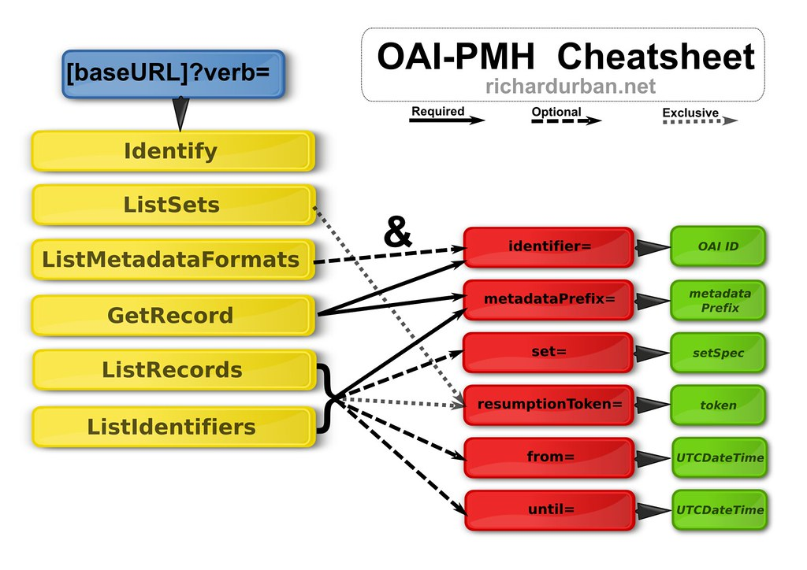

# DepositOnce - TU Berlin's repository

Here is explained how the API of TUB's DepositOnce works as well as some facts about the content of the repository.

## OAI-PMH

From the [official website](https://www.openarchives.org/pmh/): The Open Archives Initiative Protocol for Metadata Harvesting (OAI-PMH) is a low-barrier mechanism for repository interoperability. Data Providers are repositories that expose structured metadata via OAI-PMH. Service Providers then make OAI-PMH service requests to harvest that metadata. OAI-PMH is a set of six verbs or services that are invoked within HTTP.

Here is a cheat sheet with the possible queries, created by Richard Urban.

### DepositOnce - TU's repository

[Here](https://www.szf.tu-berlin.de/menue/dienste_tools/repositorium_depositonce/leitfaden_fuer_depositonce/#c776530) are the guidelines from the TUB's website.

The base URL is https://depositonce.tu-berlin.de/oai.

### edoc-Server - HU's repository

[Here](https://edoc-info.hu-berlin.de/de/nutzung/nutzung_doku) are the guidelines for the HU's repository.

The base URL is https://edoc.hu-berlin.de/oai.

### Refubium - FU's repository

[Here](https://refubium.fu-berlin.de/) are the guidelines for the HU's repository.

The base URL is https://refubium.fu-berlin.de/oai.

## Important data files

Here are brief descriptions of what the relevant data files contain. They are all stored in the folder `data/json`.

1. `subjects.json`: dictionary with the subjects as keys and a list of identifiers as values. The identifiers in the list refer to the publications that contain that subject in their metadata.
